# Bedrot Productions Media Tool Suite - Architecture Documentation

## Executive Summary

This document provides a comprehensive analysis of the **Bedrot Productions Media Tool Suite**, a Python-based collection of multimedia processing tools designed for content creation, video downloading, editing, and automated slideshow generation. The suite follows a modular architecture with a centralized launcher and supports various media formats and processing workflows.

## Table of Contents

1. [System Overview](#system-overview)
2. [Architecture Analysis](#architecture-analysis)
3. [Core Components](#core-components)
4. [Data Flow Analysis](#data-flow-analysis)
5. [Configuration Management](#configuration-management)
6. [External Dependencies](#external-dependencies)
7. [Design Patterns](#design-patterns)
8. [Security Considerations](#security-considerations)
9. [Performance Analysis](#performance-analysis)
10. [Development Recommendations](#development-recommendations)

---

## System Overview

### Business Context
The Bedrot Productions Media Tool Suite serves as a comprehensive content creation platform for video processing, media downloading, and automated slideshow generation. It's designed for content creators who need efficient tools for:

- **Media Acquisition**: Downloading content from video platforms
- **Content Remixing**: Creating new content from existing video materials
- **Automated Production**: Generating slideshows with minimal manual intervention
- **Media Processing**: Scaling, cropping, and format conversion

### High-Level Architecture

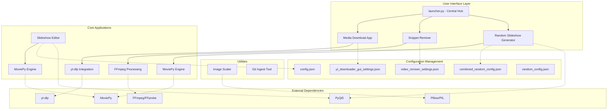

---

## Architecture Analysis

### Software Architecture Perspective

The system follows a **loosely-coupled modular architecture** with the following characteristics:

#### 1. **Centralized Launcher Pattern**
- **Component**: `launcher.py`
- **Purpose**: Serves as a process orchestrator and monitoring hub
- **Architecture**: Hub-and-spoke pattern with independent process spawning

#### 2. **Plugin-Style Application Architecture**
- Each tool operates as an independent application
- Shared configuration management pattern
- Common external dependency management

#### 3. **Multi-Framework Approach**
- **GUI Frameworks**: Tkinter (primary), PyQt5 (specialized tools)
- **Media Processing**: FFmpeg (low-level), MoviePy (high-level)
- **Cross-platform compatibility**: Windows, macOS, Linux

### Product Management Perspective

#### Target User Segments
1. **Content Creators**: Professionals needing batch video processing
2. **Social Media Managers**: Users requiring format-specific content
3. **Digital Artists**: Creators needing automated slideshow generation
4. **Hobbyists**: Users wanting simple media manipulation tools

#### Value Propositions
- **Automation**: Reduces manual effort in content creation
- **Format Optimization**: Supports platform-specific aspect ratios
- **Batch Processing**: Handles multiple files efficiently
- **Quality Control**: Maintains professional output standards

---

## Core Components

### 1. Central Launcher (`launcher.py`)

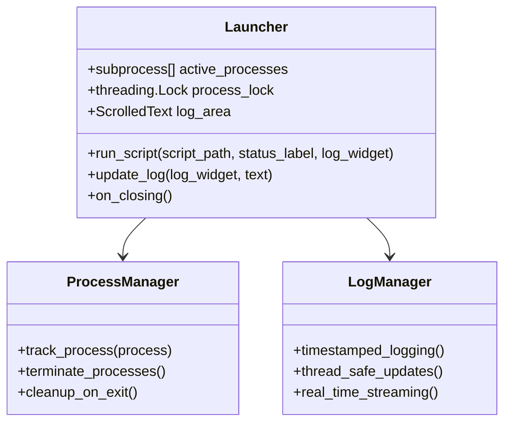

**Key Responsibilities:**
- Process lifecycle management
- Real-time log aggregation
- Cross-platform process termination
- Thread-safe GUI updates

**Design Patterns:**
- **Observer Pattern**: Log streaming from child processes
- **Process Pool Manager**: Concurrent application execution
- **Resource Management**: Proper cleanup on application exit

### 2. Media Download Application (`src/media_download_app.py`)

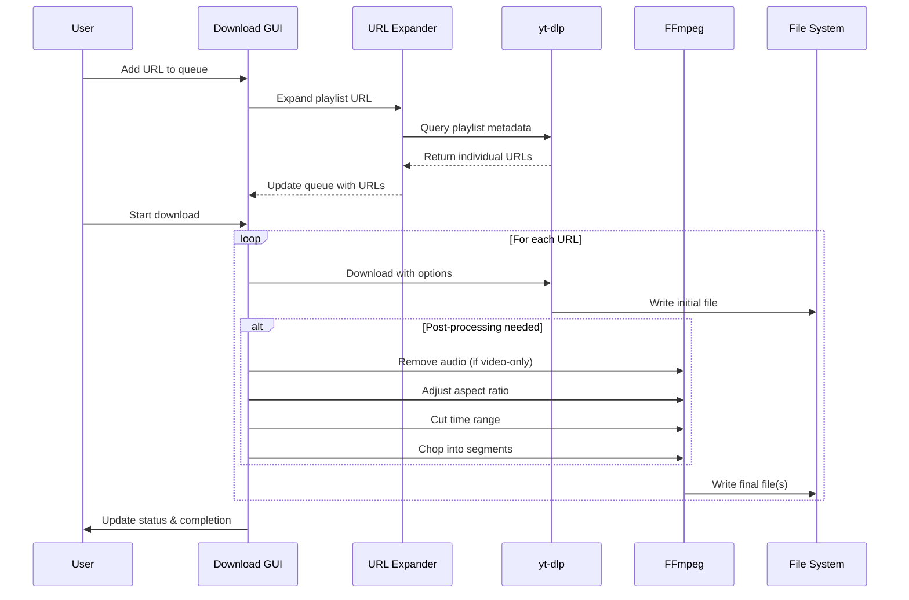

**Core Features:**
- **URL Expansion**: Automatic playlist/profile URL resolution
- **Format Flexibility**: MP4/MP3 output with quality options
- **Post-processing Pipeline**: Audio removal, aspect ratio adjustment, time cutting, video chopping
- **Batch Processing**: Queue-based sequential processing
- **Progress Tracking**: Real-time download and processing status

**Architecture Patterns:**
- **Pipeline Pattern**: Sequential processing stages
- **Command Pattern**: FFmpeg command construction
- **Strategy Pattern**: Different processing strategies for TikTok vs. general content

### 3. Snippet Remixer (`src/snippet_remixer.py`)

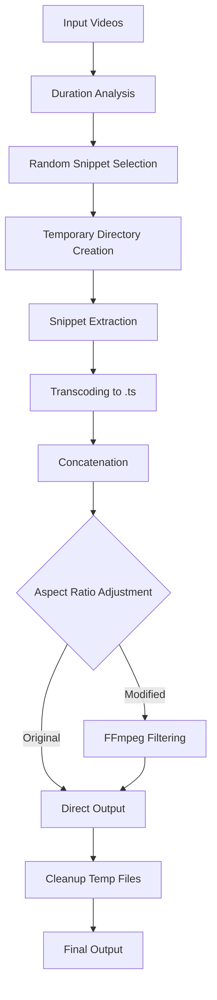

**Unique Features:**
- **BPM-based Duration Calculation**: Musical timing support
- **Intermediate Format Strategy**: Uses .ts files for reliable concatenation
- **Unique Filename Generation**: Timestamp-based collision avoidance
- **Aspect Ratio Intelligence**: Automatic crop vs. pad decisions

### 4. Random Slideshow Generator (`src/random_slideshow.py`)

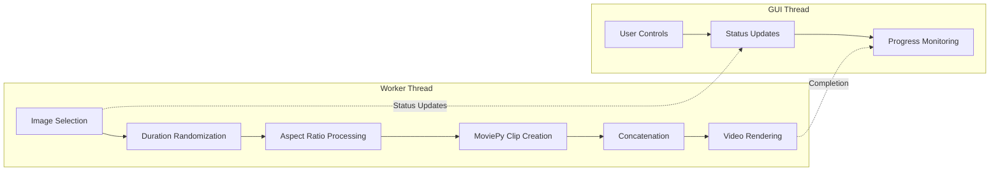

**Technical Highlights:**
- **Continuous Generation**: Infinite loop with stop controls
- **Threading Architecture**: Separate worker thread for processing
- **Dynamic Parameters**: Random duration and timing variations
- **Dual Aspect Ratio Support**: 16:9 and 9:16 with different processing strategies

### 5. Slideshow Editor (`tools/slideshow_editor.py`)

**Features:**
- **Drag-and-Drop Interface**: Intuitive file input
- **Multiple Aspect Ratios**: Flexible output formats
- **Batch Processing**: Multiple image handling
- **Threaded Rendering**: Non-blocking video creation

### 6. Image Scaler Utility (`tools/xyimagescaler.py`)

**Purpose:**
- **Precise Scaling**: Scale and crop to exact dimensions
- **Portrait Optimization**: Designed for social media formats
- **Preview System**: Visual feedback before saving

---

## Data Flow Analysis

### Configuration Data Flow

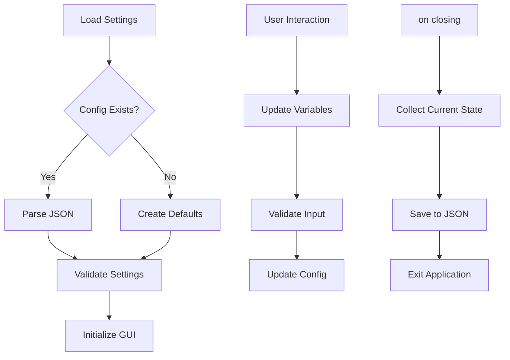

### Media Processing Pipeline

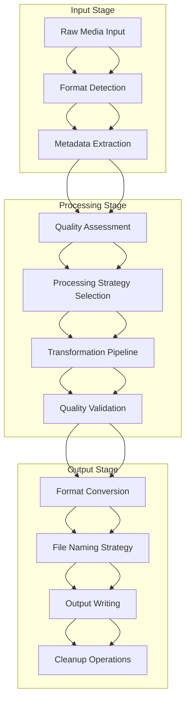

---

## Configuration Management

### Configuration Architecture

The system implements a **distributed configuration pattern** with tool-specific JSON files:

| Configuration File | Purpose | Key Settings |
|-------------------|---------|--------------|
| `config.json` | Slideshow Editor | Output folder preferences |
| `yt_downloader_gui_settings.json` | Media Downloader | Download paths, format preferences, processing options |
| `video_remixer_settings.json` | Snippet Remixer | BPM settings, aspect ratios, input/output folders |
| `combined_random_config.json` | Random Slideshow | Aspect ratio, image folder selection |
| `random_config.json` | Legacy slideshow settings | Image/output folder mapping |

### Configuration Pattern

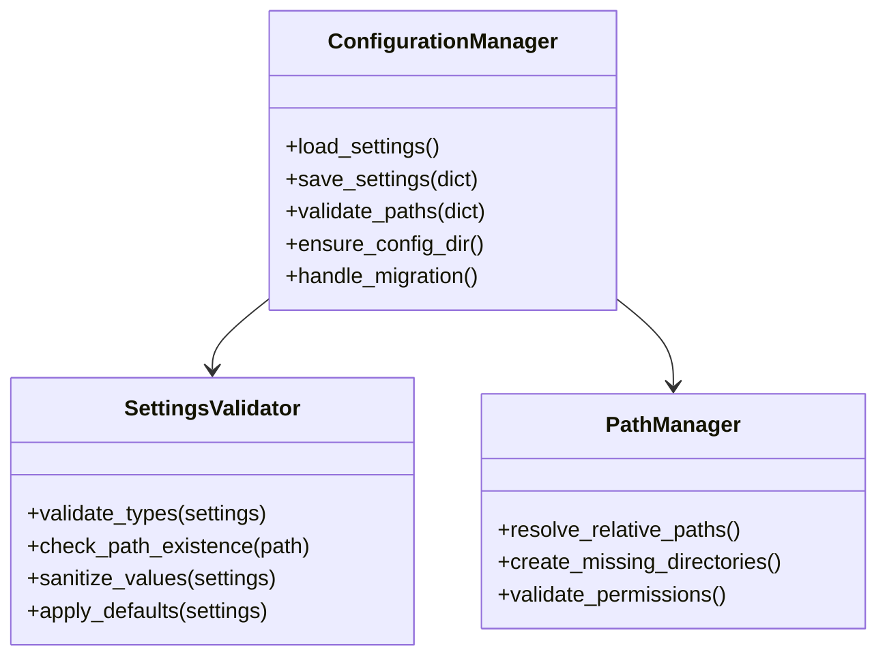

---

## External Dependencies

### Critical Dependencies

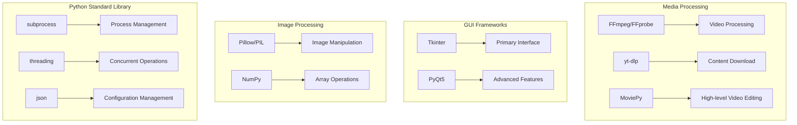

### Dependency Analysis

#### **Critical Path Dependencies**
1. **FFmpeg**: Required for all video processing operations
2. **yt-dlp**: Essential for media downloading functionality
3. **Python 3.x**: Core runtime environment

#### **Feature Dependencies**
- **PyQt5**: Required only for Random Slideshow Generator and Slideshow Editor
- **MoviePy**: Needed for high-level video operations
- **Pillow**: Required for image processing operations

#### **Fallback Strategies**
- Graceful degradation when optional dependencies are missing
- User-friendly error messages with installation guidance
- Feature disabling rather than application crashes

---

## Design Patterns

### 1. **Launcher Pattern**
- **Implementation**: Central process orchestrator
- **Benefits**: Unified monitoring, process lifecycle management
- **Trade-offs**: Single point of failure vs. simplified management

### 2. **Configuration Strategy Pattern**
- **Implementation**: Per-tool configuration files
- **Benefits**: Tool independence, settings isolation
- **Trade-offs**: Configuration scattered vs. tool autonomy

### 3. **Pipeline Pattern**
- **Implementation**: Media processing stages
- **Benefits**: Modularity, error isolation, testability
- **Trade-offs**: Complexity vs. flexibility

### 4. **Worker Thread Pattern**
- **Implementation**: Background processing with GUI updates
- **Benefits**: Responsive interface, progress reporting
- **Trade-offs**: Thread complexity vs. user experience

### 5. **Command Pattern**
- **Implementation**: FFmpeg command construction
- **Benefits**: Flexibility, parameter validation, debugging
- **Trade-offs**: Complexity vs. control

---

## Security Considerations

### Input Validation
- **File Path Sanitization**: Prevents directory traversal attacks
- **URL Validation**: Ensures proper URL format before processing
- **Configuration Validation**: Type checking and range validation

### Process Security
- **Subprocess Isolation**: Limited privileges for external tools
- **Temporary File Management**: Secure creation and cleanup
- **Resource Limits**: Prevention of resource exhaustion

### Data Privacy
- **No Network Data Collection**: All processing is local
- **Configuration Security**: Local file storage only
- **User Data Protection**: No telemetry or tracking

### Recommendations
1. **Input Sanitization**: Implement comprehensive input validation
2. **Dependency Security**: Regular updates of external tools
3. **File Permissions**: Proper access control for output directories
4. **Error Handling**: Prevent information leakage in error messages

---

## Performance Analysis

### Bottlenecks and Optimizations

#### **Media Processing Performance**

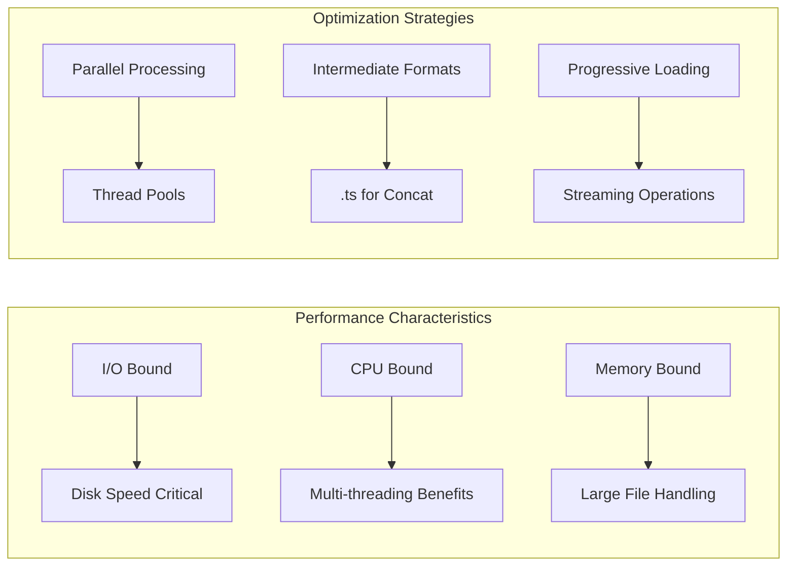

#### **Performance Metrics**
- **Download Speed**: Limited by network bandwidth and yt-dlp efficiency
- **Video Processing**: CPU-intensive, benefits from multi-core systems
- **Memory Usage**: Moderate, scales with input file sizes
- **Disk I/O**: High during processing, requires adequate storage

#### **Optimization Opportunities**
1. **Parallel Processing**: GPU acceleration for video encoding
2. **Caching**: Intermediate result caching
3. **Streaming**: Progressive processing for large files
4. **Batch Operations**: Optimized batch processing algorithms

### Resource Management

- **Memory**: Efficient cleanup of MoviePy clips
- **Disk Space**: Temporary file management and cleanup
- **CPU**: Thread pool management for concurrent operations
- **Network**: Rate limiting and retry mechanisms

---

## Development Recommendations

### Architecture Improvements

#### 1. **Modularization**
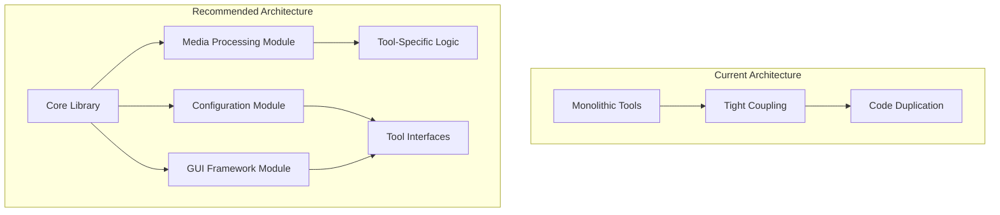

#### 2. **Configuration Unification**
- **Central Configuration Service**: Unified settings management
- **Schema Validation**: JSON schema validation
- **Migration Support**: Version compatibility handling

#### 3. **Error Handling Enhancement**
- **Structured Logging**: Centralized logging with levels
- **Error Recovery**: Automatic retry mechanisms
- **User Feedback**: Better error reporting and guidance

#### 4. **Testing Strategy**
- **Unit Tests**: Core functionality testing
- **Integration Tests**: Tool interaction testing
- **Performance Tests**: Benchmark validation
- **User Acceptance Tests**: End-to-end workflow validation

### Code Quality Improvements

#### **Code Organization**
1. **Separation of Concerns**: Split UI, business logic, and data layers
2. **Dependency Injection**: Reduce tight coupling between components
3. **Interface Definitions**: Clear contracts between modules
4. **Documentation**: Comprehensive API documentation

#### **Maintainability**
1. **Code Standards**: Consistent coding style
2. **Refactoring**: Eliminate code duplication
3. **Version Control**: Better branching and release strategies
4. **Monitoring**: Application health monitoring

### Scalability Considerations

#### **Performance Scaling**
- **Asynchronous Processing**: Non-blocking operations
- **Resource Pooling**: Efficient resource management
- **Caching Layer**: Intelligent caching strategies
- **Load Balancing**: Distribute processing load

#### **Feature Scaling**
- **Plugin Architecture**: Extensible tool framework
- **API Design**: External integration capabilities
- **Configuration Management**: Dynamic configuration updates
- **User Management**: Multi-user support potential

---

## Conclusion

The Bedrot Productions Media Tool Suite represents a well-architected solution for multimedia content creation with a clear separation of concerns and modular design. The system demonstrates strong understanding of user needs and provides comprehensive functionality through a unified interface.

### Strengths
- **Modular Architecture**: Independent tools with shared infrastructure
- **User-Centric Design**: Intuitive interfaces with comprehensive functionality
- **Cross-Platform Support**: Works across major operating systems
- **Robust Processing**: Handles edge cases and provides detailed feedback

### Areas for Improvement
- **Code Consolidation**: Reduce duplication across tools
- **Enhanced Error Handling**: More sophisticated error recovery
- **Performance Optimization**: GPU acceleration and parallel processing
- **Testing Coverage**: Comprehensive automated testing suite

### Strategic Recommendations
1. **Invest in Core Library**: Create shared functionality modules
2. **Enhance User Experience**: Improve feedback and progress reporting
3. **Expand Integration**: Add support for more platforms and formats
4. **Performance Focus**: Optimize for larger file processing

This architecture provides a solid foundation for future development and scaling, with clear paths for enhancement and optimization.

---

*Generated by Claude Code Analysis Tool*
*Date: 2025-01-16*
*Version: 1.0*