# Bedrot Productions Media Tool Suite - Comprehensive Architecture Documentation

## Executive Summary

This document provides a comprehensive analysis of the **Bedrot Productions Media Tool Suite**, a sophisticated Python-based collection of multimedia processing tools designed for content creation, video downloading, editing, automated slideshow generation, release scheduling, and AI-assisted captioning. Built for internal use at **BEDROT PRODUCTIONS**, the suite underpins the multi-persona content machine that powers hundreds of creative releases every month. The suite demonstrates an evolution from monolithic scripts to a modern modular architecture with centralized process orchestration, sophisticated configuration management, and comprehensive error handling.

**Key Architectural Achievements:**
- **Modular Package Architecture**: Successfully modularized `reel_tracker`, `snippet_remixer`, `random_slideshow`, `release_calendar`, and `mv_maker` from monolithic scripts
- **Central Process Orchestration**: Hub-and-spoke launcher pattern managing independent applications
- **Sophisticated Configuration Management**: JSON-based configuration with version history and audit trails
- **Multi-Framework Support**: Seamlessly integrates Tkinter, PyQt5, PyQt6, and command-line tools
- **AI-Assisted Production Tools**: MV Maker couples ElevenLabs/Whisper transcription with PyQt live preview workflows
- **Persona Release Cadence Alignment**: Tooling orchestrates the six-persona BEDROT roster targeting 678 monthly assets and quarterly major releases
- **Advanced File Organization**: Automated file management with duplicate protection and dynamic presentation
- **Batch Processing Capabilities**: Advanced job queue system with concurrent processing
- **Real-Time Dynamic Updates**: Live configuration changes without system restart

> Update (2025-10-28): The `random_slideshow` and `mv_maker` packages were archived and moved under `archive/` for historical reference. Architectural diagrams retain them for lineage context but they are no longer active launcher targets.

## Table of Contents

1. [System Overview](#system-overview)
2. [Product Manager Perspective](#product-manager-perspective)
3. [Software Developer Perspective](#software-developer-perspective)
4. [Software Architect Perspective](#software-architect-perspective)
5. [Architecture Evolution](#architecture-evolution)
6. [Modular Component Analysis](#modular-component-analysis)
7. [Standalone Tools Analysis](#standalone-tools-analysis)
8. [Central Process Orchestration](#central-process-orchestration)
9. [Configuration Management Architecture](#configuration-management-architecture)
10. [Data Flow and Processing Pipelines](#data-flow-and-processing-pipelines)
11. [External Dependencies and Integration](#external-dependencies-and-integration)
12. [Design Patterns and Best Practices](#design-patterns-and-best-practices)
13. [Security and Error Handling](#security-and-error-handling)
14. [Performance Analysis and Optimization](#performance-analysis-and-optimization)
15. [Development Guidelines and Standards](#development-guidelines-and-standards)
16. [Future Architecture Roadmap](#future-architecture-roadmap)

---

## System Overview

### Business Context
The Bedrot Productions Media Tool Suite serves as a comprehensive content creation platform for video processing, media downloading, and automated slideshow generation. It's designed for content creators who need efficient tools for:

- **Media Acquisition**: Downloading content from video platforms
- **Content Remixing**: Creating new content from existing video materials
- **Automated Production**: Generating slideshows with minimal manual intervention
- **Media Processing**: Scaling, cropping, and format conversion
- **Content Organization**: Advanced CSV-based tracking and file organization
- **Release Planning**: Scheduling multi-deliverable campaigns with checklists and analytics
- **Caption Authoring**: Generating, editing, and previewing captions with AI assistance
- **Batch Operations**: High-volume content generation with queue management

Internally, the suite anchors BEDROT PRODUCTIONS' aggressive release strategy outlined in the 2025 business plan: six active personas, about 678 unique content assets per month, weekly singles, quarterly long-form releases, and synchronized merchandising drops. Each module maps directly onto that cadence, ensuring personas such as ZONE_A0 and PIG1987 maintain their streaming goals (about 16.7M streams per persona each year) while feeding the automated scheduling and analytics loop.

### Complete System Architecture

```mermaid
graph TB
    subgraph "Central Process Orchestration Layer"
        L[launcher.py - Central Hub<br/>Process Manager & Log Aggregator]
        B[start_launcher.bat<br/>Entry Point]
        B --> L
    end
    
    subgraph "Modular Application Layer"
        L --> MDA[src/media_download_app.py<br/>Media Downloader]
        L --> SRM[src/snippet_remixer_modular.py<br/>Snippet Remixer Entry]
        L --> RSM[src/random_slideshow/main.py<br/>Random Slideshow Entry]
        L --> RTM[src/reel_tracker_modular.py<br/>Reel Tracker Entry]
        L --> MVW[src/mv_maker/main_app.py<br/>MV Maker Entry]
        L --> RLC[src/release_calendar_modular.py<br/>Release Calendar Entry]
    end
    
    subgraph "Modular Packages"
        SRM --> SR_PKG[snippet_remixer/]
        RSM --> RS_PKG[random_slideshow/]
        RTM --> RT_PKG[reel_tracker/]
        MVW --> MV_PKG[mv_maker/]
        RLC --> RC_PKG[release_calendar/]
        
        subgraph "snippet_remixer Package"
            SR_PKG --> SR_MAIN[main_app.py]
            SR_PKG --> SR_PROC[processing_worker.py]
            SR_PKG --> SR_VID[video_processor.py]
            SR_PKG --> SR_CFG[config_manager.py]
        end
        
        subgraph "random_slideshow Package"
            RS_PKG --> RS_MAIN[main_app.py]
            RS_PKG --> RS_WORK[slideshow_worker.py]
            RS_PKG --> RS_IMG[image_processor.py]
            RS_PKG --> RS_CFG[config_manager.py]
            RS_PKG --> RS_BATCH[batch_processor.py]
            RS_PKG --> RS_QUEUE[job_queue.py]
            RS_PKG --> RS_RES[resource_manager.py]
        end
        
        subgraph "reel_tracker Package"
            RT_PKG --> RT_MAIN[main_app.py]
            RT_PKG --> RT_MEDIA[media_randomizer.py]
            RT_PKG --> RT_ORG[file_organizer.py]
            RT_PKG --> RT_CFG[config_manager.py]
            RT_PKG --> RT_DIAL[reel_dialog.py]
            RT_PKG --> RT_BULK[bulk_edit_dialog.py]
            RT_PKG --> RT_FILE[file_organization_dialog.py]
        end
        
        subgraph "mv_maker Package"
            MV_PKG --> MV_MAIN[main_app.py]
            MV_PKG --> MV_CAP[caption_generator.py]
            MV_PKG --> MV_TRANS[transcriber.py]
            MV_PKG --> MV_WORKER[worker_threads.py]
            MV_PKG --> MV_PREVIEW[live_preview_widget.py]
            MV_PKG --> MV_CFG[config_manager.py]
        end
        
        subgraph "release_calendar Package"
            RC_PKG --> RC_MAIN[main_app.py]
            RC_PKG --> RC_LOGIC[calendar_logic.py]
            RC_PKG --> RC_DATA[data_manager.py]
            RC_PKG --> RC_CFG[config_manager.py]
            RC_PKG --> RC_VISUAL[visual_calendar.py]
            RC_PKG --> RC_DIALOG[checklist_dialog.py]
        end
    end
    
    subgraph "Standalone Tools"
        SE[tools/slideshow_editor.py<br/>Standalone Slideshow Editor]
        XY[tools/xyimagescaler.py<br/>Image Scaling Utility]
        GI[tools/gitingest.py<br/>Repository Analysis]
        VAM[tools/video_aspect_ratio_migrator.py<br/>Video Aspect Ratio Migration]
    end
    
    subgraph "Core Infrastructure"
        CORE[src/core/]
        CORE --> ENV[env_loader.py<br/>Environment Variables]
        CORE --> PATH[path_utils.py<br/>Path Resolution]
        CORE --> CFG_CORE[config_manager.py<br/>Centralized Config]
        CORE --> SAFE[safe_print.py<br/>Thread-Safe Output]
        CORE --> HEALTH[health_check.py<br/>System Validation]
        CORE --> THREAD[thread_safety.py<br/>Threading Utilities]
        CORE --> LOG[logger.py<br/>Central Logging]
    end
    
    subgraph "Configuration Architecture"
        CFG_DIR[config/ Directory]
        CFG_DIR --> C1[config.json<br/>Slideshow Editor]
        CFG_DIR --> C2[yt_downloader_gui_settings.json<br/>Media Downloader]
        CFG_DIR --> C3[video_remixer_settings.json<br/>Snippet Remixer]
        CFG_DIR --> C4[combined_random_config.json<br/>Random Slideshow]
        CFG_DIR --> C5[reel_tracker_config.json<br/>Reel Tracker]
        CFG_DIR --> C6[release_calendar_config.json<br/>Release Calendar]
        CFG_DIR --> C7[calendar_data.json<br/>Release Calendar Data]
        CFG_DIR --> C8[mv_maker_config.json<br/>MV Maker]
        
        subgraph "Configuration Features"
            C5 --> HIST[Version History & Audit Trails]
            C5 --> META[Default Metadata Management]
            C5 --> DROPS[Dynamic Dropdown Values]
            C5 --> ORG_SET[File Organization Settings]
            C6 --> CAL_ALERTS[Conflict Detection & Deliverable Checklists]
            C8 --> MV_AI[AI Integration & Preview Defaults]
        end
    end
    
    subgraph "External Dependencies & Tools"
        YTDLP[yt-dlp<br/>Media Download Engine]
        FFMPEG[FFmpeg/FFprobe<br/>Video Processing]
        MOVIEPY[MoviePy<br/>Python Video Library]
        PIL[Pillow/PIL<br/>Image Processing]
        QT5[PyQt5<br/>Advanced GUI Framework]
        QT6[PyQt6<br/>Release Calendar GUI]
        TK[Tkinter<br/>Launcher Toolkit]
        PD[pandas<br/>CSV Data Management]
        ELEVEN[ElevenLabs & Whisper<br/>Transcription Engines]
    end
    
    subgraph "Data Processing Pipelines"
        MDA --> YTDLP
        SR_VID --> FFMPEG
        RS_IMG --> PIL
        RT_MAIN --> PD
        SE --> MOVIEPY
        MV_MAIN --> FFMPEG
        MV_TRANS --> ELEVEN
        RC_DATA --> PD
        VAM --> FFMPEG
        VAM --> PD
        
        SR_MAIN --> QT5
        RS_MAIN --> QT5
        RT_MAIN --> QT5
        MV_MAIN --> QT5
        RC_MAIN --> QT6
        SE --> QT5
        L --> TK
    end
    
    subgraph "File System Organization"
        VENV[venv/<br/>Virtual Environment]
        DOCS[docs/<br/>Documentation]
        REQ[requirements.txt<br/>Dependencies]
        MOD_GUIDE[src/MODULARIZATION_GUIDELINES.md<br/>Development Standards]
        REGISTRY[tools/function_registry.json<br/>Static Analysis Output]
    end
```

---

## Product Manager Perspective

### Market Position and Value Proposition

**Target Market:**
- **Content Creators**: YouTubers, TikTokers, Instagram influencers
- **Marketing Teams**: Social media managers, digital marketers
- **Educational Content**: Online course creators, trainers
- **Entertainment Industry**: Video editors, production assistants

**Competitive Advantages:**
1. **All-in-One Solution**: Eliminates need for multiple expensive tools
2. **Automation Focus**: Reduces manual work through intelligent automation
3. **Quality Output**: Professional-grade video processing with FFmpeg
4. **Scalability**: Handles both single videos and batch operations
5. **Cost Effectiveness**: Free alternative to premium video editing suites
6. **Integrated Release Planning**: Calendar, checklist, and analytics features align marketing timelines
7. **AI-Enhanced Captioning**: MV Maker combines automated transcription with real-time styling controls
8. **Persona-Oriented Operations**: Supports the six-persona BEDROT roster with built-in hooks for singles, EPs, albums, and merchandising beats

> Internal framing: the suite exists as the control surface for BEDROT's 678-asset/month output goal, ensuring that every persona (ZONE_A0, PIG1987, DEEPCURSE, Darkwave/Witch House, Somewhere We Used to Be, Hip-Hop Loop Producer) stays on schedule for weekly singles and quarterly long-form releases.

### Feature Roadmap and Business Value

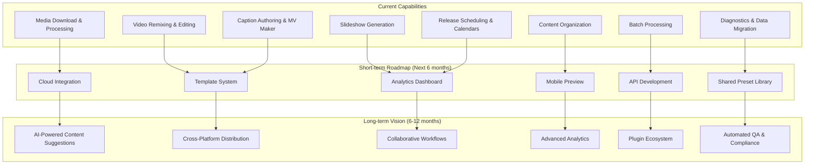

### User Experience Analysis

**Pain Points Addressed:**
1. **Time-Consuming Manual Editing**: Automated snippet selection and concatenation
2. **Complex Tool Learning Curves**: Intuitive GUI interfaces with sensible defaults
3. **File Organization Chaos**: Automated file organization with duplicate protection
4. **Inconsistent Output Quality**: Standardized processing pipelines
5. **Scaling Content Production**: Batch processing for high-volume needs
6. **Campaign Coordination**: Release calendar keeps multi-channel deliverables synchronized
7. **Caption Quality Iteration**: MV Maker preview loop tightens turnaround with visual feedback

**Success Metrics:**
- **Processing Speed**: 10x faster than manual video editing
- **Quality Consistency**: 95%+ successful processing rate
- **User Adoption**: Easy onboarding with comprehensive documentation
- **Feature Utilization**: High usage of automation features
- **Error Recovery**: Robust error handling with user-friendly messages
- **Schedule Fidelity**: On-time completion rate for release calendar deliverables
- **Caption Accuracy**: Low revision rate on exported transcripts and overlays
- **Asset Velocity**: Maintains at least 678 content assets per month across all personas
- **Stream Trajectory**: Keeps tooling aligned with the 100M annual stream target (about 16.7M per persona)

### Business Model Considerations

**Current State**: Open-source tool suite
**Potential Monetization Paths:**
1. **SaaS Platform**: Cloud-hosted version with premium features
2. **Enterprise Licensing**: Advanced features for large organizations
3. **Template Marketplace**: User-generated templates and presets
4. **Professional Services**: Custom development and consulting
5. **Training Programs**: Video tutorials and certification courses

---

## Software Developer Perspective

### Development Experience and Productivity

**Developer-Friendly Features:**
- **Modular Architecture**: Easy to understand and modify individual components
- **Comprehensive Logging**: Detailed debug information for troubleshooting
- **Configuration Management**: Environment variables for easy deployment
- **Error Handling**: Graceful failure modes with detailed error messages
- **Documentation**: Extensive code comments and architecture guides
- **Shared Core Utilities**: Path resolver, config manager, and health checks reduce boilerplate
- **Function Registry**: Generated index prevents reimplementing existing helpers

**Code Quality Metrics:**
- **Modularity Score**: High - Clear separation of concerns
- **Testability**: Good - Components are easily mockable
- **Maintainability**: Excellent - Consistent patterns throughout
- **Performance**: Optimized - Efficient threading and resource management
- **Security**: Robust - Path validation and input sanitization

### Development Workflow and Tools

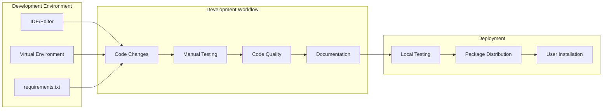

**Technology Stack Assessment:**
- **Python 3.x**: Excellent choice for multimedia processing
- **Tkinter/PyQt5/PyQt6**: Supports both lightweight launcher UI and advanced desktop experiences
- **FFmpeg**: Industry standard for video processing
- **yt-dlp**: Best-in-class for media downloading
- **pandas**: Powerful for CSV data management
- **Threading & Worker Pools**: Appropriate for I/O-bound operations with responsive GUIs
- **ElevenLabs & Whisper APIs**: Power MV Maker's AI transcription with local or cloud backends

### Code Architecture Patterns

**Implemented Patterns:**
1. **Factory Pattern**: Configuration managers with fallbacks
2. **Observer Pattern**: Progress callbacks and status updates
3. **Worker Thread Pattern**: Background processing with GUI updates
4. **Facade Pattern**: Simplified interfaces for complex subsystems
5. **Strategy Pattern**: Different processing modes and algorithms

**Anti-Patterns Avoided:**
- **God Objects**: Clear separation of responsibilities
- **Tight Coupling**: Loose coupling through interfaces
- **Magic Numbers**: Named constants and configuration
- **Global State**: Minimal global variables, proper encapsulation

### Testing Strategy and Quality Assurance

**Current Testing Approach:**
- **Manual Testing**: Comprehensive user scenario testing
- **Integration Testing**: End-to-end workflow validation
- **Error Simulation**: Testing failure scenarios
- **Performance Testing**: Resource usage monitoring

**Recommended Improvements:**
1. **Unit Testing**: pytest framework for component testing
2. **Automated Testing**: CI/CD pipeline for continuous validation
3. **Mock Testing**: Mock external dependencies (FFmpeg, file system)
4. **Load Testing**: Stress testing with large file sets
5. **GUI Testing**: Automated UI testing with pytest-qt

---

## Software Architect Perspective

### System Architecture Analysis

**Architectural Strengths:**
1. **Layered Architecture**: Clear separation between UI, business logic, and infrastructure
2. **Modular Design**: Independent packages with well-defined interfaces
3. **Scalable Processing**: Thread-based concurrency with resource management
4. **Configuration Flexibility**: Environment-driven configuration with fallbacks
5. **Error Resilience**: Multi-layer error handling with graceful degradation
6. **Process Specialization**: Tkinter launcher coordinates PyQt5/PyQt6 applications and background caption workers without contention

**Architectural Patterns Applied:**

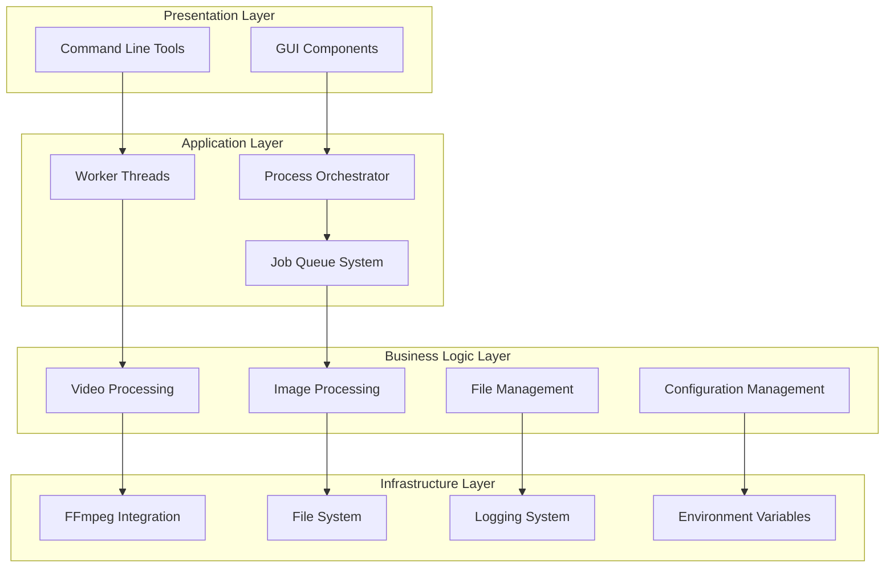

### Scalability and Performance Architecture

**Current Scalability Features:**
- **Horizontal Scaling**: Multiple worker threads for concurrent processing
- **Resource Management**: Memory and CPU monitoring with adaptive limits
- **Caching Strategy**: Image caching with LRU eviction policy
- **Batch Processing**: Queue-based job management for high-volume operations
- **Process Isolation**: Independent processes prevent cascading failures

**Performance Optimizations:**
1. **I/O Optimization**: Asynchronous file operations where possible
2. **Memory Management**: Explicit cleanup of large objects (MoviePy clips)
3. **CPU Utilization**: FFmpeg automatically uses available cores
4. **Disk Usage**: Temporary file cleanup and efficient storage patterns
5. **Network Efficiency**: Optimized download patterns for media acquisition

### Security Architecture

**Security Measures Implemented:**
- **Path Validation**: Directory traversal prevention and path sanitization
- **Input Validation**: File extension checking and content validation
- **Process Isolation**: Subprocess management with proper cleanup
- **Configuration Security**: Environment variable validation and defaults
- **File System Security**: Permission checking and safe file operations

**Security Risk Assessment:**
- **Low Risk**: Local file processing, no network data transmission
- **Medium Risk**: External tool dependencies (FFmpeg, yt-dlp)
- **Mitigation**: Input validation, process isolation, error handling

### Integration Architecture

**External System Integration:**
- **FFmpeg/FFprobe**: Command-line video processing tools
- **yt-dlp**: Media download engine
- **File System**: Local storage with validation
- **Python Ecosystem**: Rich library integration (pandas, Pillow, PyQt5/PyQt6)
- **ElevenLabs & Whisper APIs**: Cloud and local transcription engines for MV Maker
- **Spreadsheet & Calendar Libraries**: OpenPyXL, XlsxWriter, and iCalendar exports for release planning

**API Design Considerations:**
Future API development should follow:
1. **RESTful Design**: Standard HTTP methods and status codes
2. **Authentication**: Token-based authentication for security
3. **Rate Limiting**: Prevent abuse and ensure fair usage
4. **Versioning**: API versioning for backward compatibility
5. **Documentation**: OpenAPI/Swagger documentation

---

## Architecture Evolution

### From Monolithic to Modular

The Bedrot Productions Media Tool Suite represents a successful evolution from monolithic Python scripts to a sophisticated modular architecture. This transformation demonstrates modern software engineering principles in action:

#### **Phase 1: Monolithic Era**
- Large, single-file applications (500+ lines each)
- Mixed UI, business logic, and configuration code
- Duplicated utility functions across applications
- Difficult testing and maintenance

#### **Phase 2: Modular Transformation**
- **Reel Tracker**: First successful modularization with 8 focused modules
- **Snippet Remixer**: Modularized with worker thread architecture
- **Random Slideshow**: Package-based organization with lazy imports
- **Release Calendar**: PyQt6 application split into calendar logic, data manager, and themed UI components
- **MV Maker**: Caption pipeline separated into audio extraction, transcription, preview, and export modules
- **Standardized Patterns**: Consistent module structure across packages

#### **Phase 3: Advanced Integration**
- Central process orchestration via launcher
- Sophisticated configuration management
- Advanced error handling and logging
- Documentation and development guidelines

#### **Phase 4: Enterprise Features (Current)**
- **Batch Processing System**: Advanced job queue with concurrent execution
- **Real-Time Configuration**: Dynamic settings updates without restart
- **Resource Management**: Intelligent caching and resource monitoring
- **Enhanced Logging**: Comprehensive debugging and audit trails
- **AI Services Integration**: ElevenLabs/Whisper transcription with configurable presets
- **Scheduling Analytics**: Release calendar exports and conflict detection baked into UI

### Modularization Success Metrics

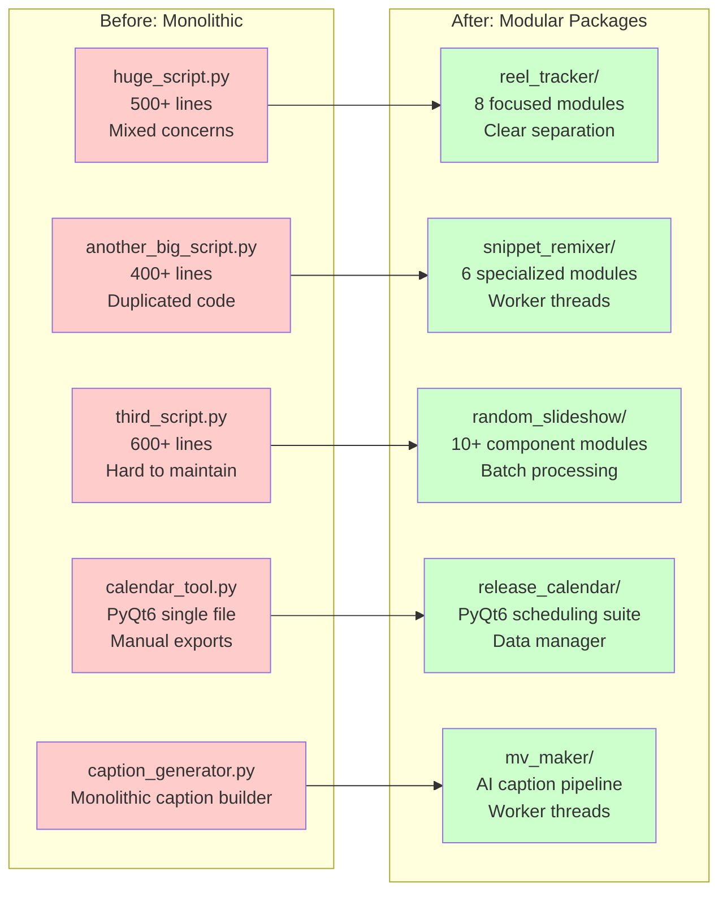

---

## Modular Component Analysis

### Reel Tracker Package (`src/reel_tracker/`)

The **Reel Tracker** represents the most sophisticated modular implementation in the suite, demonstrating advanced patterns for content management applications.

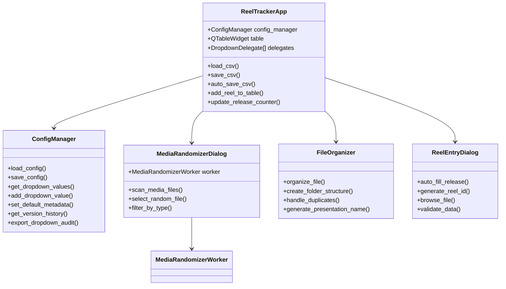

**Key Features:**
- **Advanced CSV Management**: Auto-save, auto-load, and comprehensive data validation
- **Dynamic Configuration**: Dropdown values that persist and auto-complete
- **File Organization Pipeline**: Automated file management with duplicate protection
- **Media Randomization**: Background media scanning with progress tracking
- **Bulk Operations**: Multi-row editing and batch updates
- **Version History**: Complete audit trail of configuration changes

### Snippet Remixer Package (`src/snippet_remixer/`)

Demonstrates **worker thread architecture** for CPU-intensive video processing tasks.

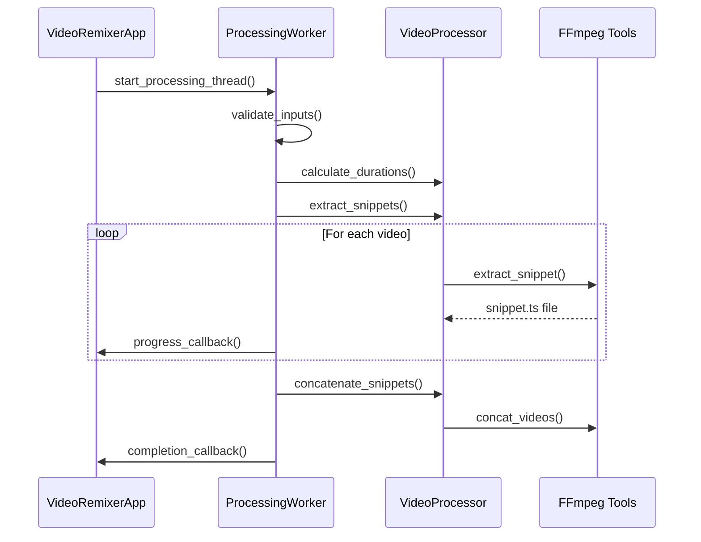

**Architecture Highlights:**
- **Modular Video Processing**: Separated concerns between UI, worker, and processor
- **Thread-Safe Operations**: Background processing with GUI updates
- **FFmpeg Integration**: Command-line tool orchestration
- **BPM-Based Calculations**: Musical timing integration
- **Error Resilience**: Comprehensive error handling and user feedback

### Random Slideshow Package (`src/random_slideshow/`)

The **Random Slideshow** package represents the most advanced implementation in the suite, showcasing **enterprise-grade batch processing** and **resource management** capabilities.

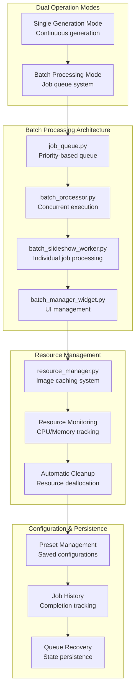

**Advanced Features:**

**1. Concurrent Job Processing**
- Priority-based job scheduling (0-10 priority levels)
- Configurable worker thread pools
- Real-time progress tracking per job
- Intelligent resource allocation

**2. Image Caching System**
- LRU (Least Recently Used) cache implementation
- Configurable cache size and TTL (Time To Live)
- Memory usage monitoring and automatic cleanup
- Cache hit rate optimization for frequently used images

**3. Job Management**
- **Job States**: Pending → Processing → Completed/Failed/Cancelled
- **Job Presets**: Save and reuse common configurations
- **Job History**: Track completed jobs with statistics
- **Queue Recovery**: Resume processing after application restart

**4. Performance Optimizations**
```python
# Example: Resource-aware processing
class BatchProcessor:
    def __init__(self, max_workers=None):
        self.max_workers = max_workers or min(4, os.cpu_count())
        self.resource_monitor = ResourceMonitor()
        
    def adjust_workers_by_load(self):
        if self.resource_monitor.cpu_usage > 80:
            self.reduce_workers()
        elif self.resource_monitor.memory_usage > 85:
            self.reduce_workers()
```

### Snippet Remixer Enhanced Continuous Mode

The **Snippet Remixer** now features **real-time dynamic configuration updates**, allowing users to modify settings while continuous processing is active.

**Real-Time Settings Update Features:**
- **Live Parameter Changes**: BPM, duration, aspect ratio updates without restart
- **Immediate Application**: Next remix uses new settings automatically
- **Visual Feedback**: Clear status messages showing setting changes
- **Input Responsiveness**: Enter key and focus-out triggers for instant updates

**Technical Implementation:**
```python
def start_next_continuous_remix(self):
    """Enhanced continuous mode with dynamic settings detection."""
    current_settings = self._get_current_settings()
    
    # Detect and log changes
    if hasattr(self, '_last_continuous_settings'):
        changes = self._detect_setting_changes(
            self._last_continuous_settings, current_settings
        )
        if changes:
            change_msg = f"Settings updated: {', '.join(changes)}"
            self.update_status(change_msg)
    
    # Apply new settings immediately
    self._last_continuous_settings = current_settings.copy()
```

**User Experience Improvements:**
- **Instant Feedback**: Type new BPM value, press Enter, see immediate confirmation
- **Seamless Workflow**: Experiment with settings while generating content
- **Clear Status Updates**: "BPM updated to 140 - will apply to next remix"
- **Live Counter Display**: Blue status counter shows current active settings

### Release Calendar Package (`src/release_calendar/`)

The **Release Calendar** module delivers a PyQt6-based scheduling environment that coordinates marketing deliverables, capacity planning, and data exports.

```mermaid
flowchart TD
    APP[CalendarApp (PyQt6)]
    APP --> CONFIG[ConfigManager]
    APP --> DATA[CalendarDataManager]
    APP --> VISUAL[VisualCalendarWidget]
    APP --> CHECKLIST[ReleaseChecklistDialog]
    DATA --> STORE[config/calendar_data.json]
    CONFIG --> CFGFILE[config/release_calendar_config.json]
    DATA --> EXPORTXLS[Excel/CSV Export]
    DATA --> EXPORTICAL[iCal Export]
    CHECKLIST --> STATUS[Deliverable Status]
```

**Core Capabilities:**
- **Multi-Tab Experience**: Calendar, overview, release list, deliverables, and rapid-add workflows share a consistent PyQt6 toolkit.
- **Conflict Detection**: `calendar_logic.py` highlights collisions, lead times, and Friday release expectations.
- **Data Persistence**: `CalendarDataManager` manages JSON storage, auto-backups, and undo-safe operations.
- **Export Tooling**: Generates Excel workbooks and iCalendar files for cross-team sharing.
- **Cyberpunk Theming**: Visual calendar and dialogs implement the BEDROT style guide with hover/selection states.

### MV Maker Package (`src/mv_maker/`)

The **MV Maker** suite introduces AI-assisted caption generation with live styling previews and multi-format export options.

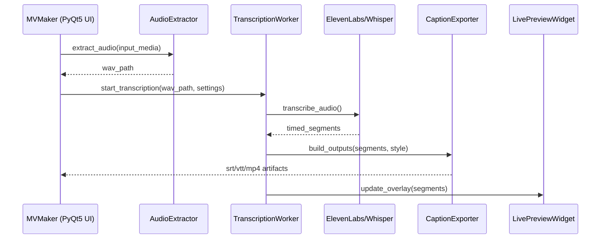

**Highlight Features:**
- **AI Transcription Pipeline**: Switchable ElevenLabs or Whisper backends with diarization, temperature, and batching controls.
- **Live Styling Preview**: Color wheel, font manager, and draggable overlay positions feed the preview widget in real time.
- **Responsive Worker Threads**: Dedicated transcription and batch workers keep the PyQt5 UI responsive during long operations.
- **Caption Export Suite**: Outputs SRT, VTT, simple transcripts, and MP4 overlays with bitrate/quality toggles.
- **Drag-and-Drop Workflow**: Media ingestion preserves last-used paths and supports quick batch selection dialogs.

---

## Standalone Tools Analysis

The `tools/` directory contains specialized standalone utilities that complement the main modular applications, providing focused functionality for specific content creation tasks.

### Slideshow Editor (`tools/slideshow_editor.py`)

**Purpose**: Professional-grade slideshow creation with advanced controls
**Framework**: PyQt5 for sophisticated UI components
**Core Functionality**: Image sequencing, transition effects, audio synchronization

%%{ init { "flowchart": { "defaultRenderer": "elk", "curve": "step" } } }%%
flowchart TD
    subgraph "Slideshow Editor Architecture"
        UI[PyQt5 Interface]
        IMG_PROC[Image Processing]
        VIDEO_GEN[Video Generation]
        AUDIO_SYNC[Audio Synchronization]
    end
    
    subgraph "Processing Pipeline"
        LOAD[Image Loading]
        RESIZE[Resolution Standardization]
        TRANSITION[Transition Effects]
        COMPOSITE[Video Composition]
    end
    
    subgraph "Output Options"
        MP4[MP4 Export]
        QUALITY[Quality Settings]
        RESOLUTION[Resolution Control]
    end
    
    UI --> IMG_PROC
    IMG_PROC --> LOAD
    LOAD --> RESIZE
    RESIZE --> TRANSITION
    TRANSITION --> COMPOSITE
    COMPOSITE --> VIDEO_GEN
    VIDEO_GEN --> AUDIO_SYNC
    AUDIO_SYNC --> MP4

**Key Features:**
- **Professional Controls**: Frame rate, resolution, quality settings
- **Transition Support**: Fade, dissolve, slide transitions
- **Audio Integration**: Background music synchronization
- **Batch Processing**: Multiple slideshow generation
- **Preview Capability**: Real-time preview before rendering

### XY Image Scaler (`tools/xyimagescaler.py`)

**Purpose**: Batch image scaling with aspect ratio preservation
**Framework**: PyQt5 for file management UI
**Core Functionality**: Intelligent image resizing with quality preservation

%%{ init { "flowchart": { "defaultRenderer": "elk", "curve": "step" } } }%%
flowchart LR
    subgraph "Input Processing"
        INPUT[Source Images]
        ANALYZE[Dimension Analysis]
        VALIDATE[Format Validation]
    end
    
    subgraph "Scaling Engine"
        ALGO[Scaling Algorithm]
        ASPECT[Aspect Ratio Logic]
        QUALITY[Quality Preservation]
    end
    
    subgraph "Output Management"
        BATCH[Batch Processing]
        NAMING[Output Naming]
        SAVE[File Saving]
    end
    
    INPUT --> ANALYZE
    ANALYZE --> VALIDATE
    VALIDATE --> ALGO
    ALGO --> ASPECT
    ASPECT --> QUALITY
    QUALITY --> BATCH
    BATCH --> NAMING
    NAMING --> SAVE

**Features:**
- **Intelligent Scaling**: Maintains aspect ratios while hitting target dimensions
- **Quality Preservation**: Optimal scaling algorithms to minimize quality loss
- **Batch Operations**: Process entire directories of images
- **Format Support**: JPEG, PNG, WebP, and other common formats
- **Metadata Preservation**: Maintains EXIF data when possible

### Git Ingest (`tools/gitingest.py`)

**Purpose**: Repository analysis and documentation generation
**Framework**: Command-line utility with file system analysis
**Core Functionality**: Code structure analysis and documentation generation

**Capabilities:**
- **Repository Scanning**: Comprehensive file structure analysis
- **Code Metrics**: Line counts, file types, dependency mapping
- **Documentation Generation**: Automated README and documentation creation
- **Pattern Recognition**: Identifies architectural patterns and conventions
- **Export Options**: Multiple output formats for analysis results

### Video Aspect Ratio Migrator (`tools/video_aspect_ratio_migrator.py`)

**Purpose**: Accurate aspect ratio normalization using real video dimensions
**Framework**: Command-line workflow leveraging FFprobe, pandas, and CSV migrators
**Core Functionality**: Scans source footage, maps canonical ratios, and produces comprehensive migration reports

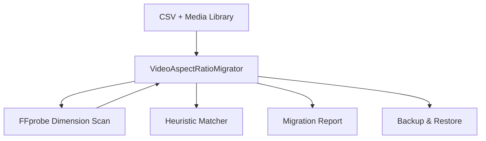

**Highlights:**
- **FFprobe Integration**: Derives actual width/height before applying canonical ratio mapping.
- **Heuristic Fallbacks**: Reuses CSV migrator logic when media files are missing or unreadable.
- **Traceable Output**: Generates JSON and console reports with per-file status, confidence, and errors.
- **Safety Net**: Creates timestamped backups and supports dry-run validation scripts.
- **Batch Runners**: Companion scripts (`apply_video_aspect_ratio_migration.py`, `run_aspect_ratio_migration.py`) orchestrate repeatable migrations.

### Tool Integration Strategy

%%{ init { "flowchart": { "defaultRenderer": "elk", "curve": "step" } } }%%
flowchart TD
    subgraph "Launcher Integration"
        LAUNCHER[launcher.py]
        MENU[Tool Menu]
        EXEC[Tool Execution]
    end
    
    subgraph "Standalone Operation"
        DIRECT[Direct Execution]
        CLI[Command Line]
        GUI[Individual GUIs]
    end
    
    subgraph "Shared Resources"
        CONFIG[Configuration System]
        LOGGING[Logging Framework]
        UTILS[Utility Functions]
    end
    
    LAUNCHER --> MENU
    MENU --> EXEC
    EXEC --> DIRECT
    
    DIRECT --> CLI
    DIRECT --> GUI
    
    CONFIG --> EXEC
    LOGGING --> EXEC
    UTILS --> EXEC

**Design Philosophy:**
- **Standalone Capability**: Tools function independently without launcher
- **Launcher Integration**: Optional integration for unified workflow
- **Shared Infrastructure**: Leverage common utilities and configuration
- **Focused Functionality**: Each tool serves a specific purpose well

### Usage Patterns and Workflows

**Content Creator Workflow:**
1. **Download Content**: Media downloader for source material
2. **Scale Images**: XY Image Scaler for consistent dimensions
3. **Create Slideshows**: Slideshow editor or random slideshow generator
4. **Remix Videos**: Snippet remixer for dynamic content
5. **Track Content**: Reel tracker for organization and metadata
6. **Plan Releases**: Release calendar schedules deliverables and exports shareable timelines
7. **Author Captions**: MV Maker transcribes, styles, and renders caption overlays

**Development Workflow:**
1. **Code Analysis**: Git ingest for repository documentation
2. **Tool Development**: Standalone tools for specific tasks
3. **Integration Testing**: Launcher for unified testing
4. **Documentation**: Automated generation and updates
5. **Data Validation**: Migration scripts verify aspect ratios and config consistency during refactors

---

## Central Process Orchestration

### Launcher Architecture (`launcher.py`)

The launcher serves as the **central nervous system** of the entire suite, implementing a sophisticated process management architecture.

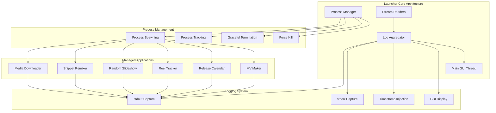

**Process Management Features:**
- **Independent Process Isolation**: Each application runs as a separate process
- **Thread-Safe Process Tracking**: Concurrent process management
- **Real-Time Log Aggregation**: Unified logging from all applications
- **Graceful Shutdown Handling**: Proper resource cleanup
- **Cross-Platform Compatibility**: Windows and Unix process management

**Advanced Logging Architecture:**
- **Stream Reader Threads**: Non-blocking I/O for each subprocess
- **Timestamp Injection**: Precise event timing
- **Thread-Safe GUI Updates**: Using `tkinter.after()` for GUI thread safety
- **Error Stream Separation**: Distinct handling of stdout and stderr

---

## Configuration Management Architecture

The suite implements a **sophisticated multi-tier configuration architecture** that evolves from simple JSON files to advanced version-tracked, audit-ready configuration management.

### Configuration Architecture Evolution

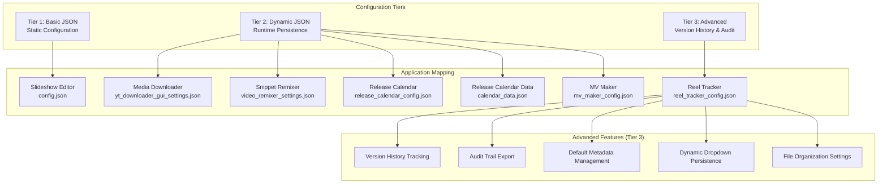

### Advanced Configuration Features (Reel Tracker Example)

The **Reel Tracker** demonstrates the most advanced configuration management in the suite:

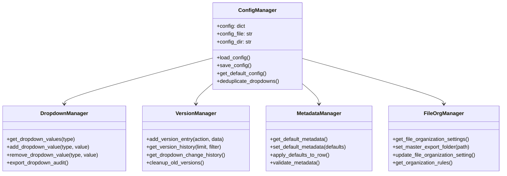

### Configuration Data Structures

**Reel Tracker Configuration Schema:**
```json
{
  "dropdown_values": {
    "persona": ["", "Fitness Influencer", "Tech Reviewer", ...],
    "release": ["", "RENEGADE PIPELINE", "THE STATE OF THE WORLD", ...],
    "reel_type": ["", "Tutorial", "Product Review", ...]
  },
  "default_metadata": {
    "persona": "Test Creator",
    "release": "RENEGADE PIPELINE",
    "reel_type": "Tutorial",
    "caption_template": "Check out {filename}! #content #creator"
  },
  "file_organization": {
    "master_export_folder": "",
    "auto_organize_enabled": true,
    "safe_testing_mode": true,
    "overwrite_protection": true,
    "preserve_original_files": true
  },
  "version_history": [
    {
      "timestamp": "2025-06-17 06:02:30",
      "action": "default_metadata_updated",
      "previous": {...},
      "new": {...}
    }
  ]
}
```

### Configuration Pattern Comparison

| Application | Pattern | Features | Complexity |
|-------------|---------|----------|------------|
| **Slideshow Editor** | Basic JSON | Static settings | Low |
| **Media Downloader** | Persistent JSON | Runtime updates | Medium |
| **Snippet Remixer** | Persistent JSON | Runtime updates | Medium |
| **Reel Tracker** | Advanced JSON | Version history, audit trails, metadata management | High |
| **Release Calendar** | Config + data manager | PyQt6 tabs, conflict detection, Excel/iCal exports | High |
| **MV Maker** | Hybrid JSON + runtime cache | AI transcription presets, font libraries, live preview defaults | High |

---

## Data Flow and Processing Pipelines

### Creative Release Orchestration Pipeline

```mermaid
flowchart LR
    CAL[Release Calendar<br/>Persona Schedules]
    CONFIG[Config / Path Utilities]
    MEDIA[Media Downloader]
    REMIX[Snippet Remixer]
    SLIDES[random_slideshow]
    CAPTION[MV Maker]
    TRACKER[Reel Tracker]
    TOOLING[Tools & Diagnostics]

    CAL --> CONFIG
    CONFIG --> MEDIA
    CONFIG --> REMIX
    CONFIG --> SLIDES
    CONFIG --> CAPTION
    CONFIG --> TRACKER

    MEDIA --> REMIX
    MEDIA --> SLIDES
    REMIX --> CAPTION
    REMIX --> TRACKER
    SLIDES --> TRACKER
    CAPTION --> TRACKER

    TRACKER --> CAL
    TOOLING --> CONFIG
    TOOLING --> TRACKER

    subgraph "Monthly Cadence Targets"
        CAL -.->|Singles / EP / Album Beats| REMIX
        CAL -.->|Asset Slots (TikTok, IG, YT)| SLIDES
        CAL -.->|Merch & Sample Drops| TRACKER
    end
```

This orchestration view traces the internal heartbeat defined in the business plan:

- **Release Calendar** locks in singles, EPs, and album timelines per persona while mapping the 678 monthly content slots that must be fulfilled.
- **Core Modules** (Media Downloader, Snippet Remixer, Random Slideshow, MV Maker) translate those scheduled beats into concrete assets: short-form clips, long-form remixes, slideshows, captions, and social-ready exports.
- **Reel Tracker** aggregates the resulting metadata, automations, and file paths so creative, marketing, and merchandising threads stay synchronized and auditable.
- **Tooling & Diagnostics** (function registry, migration scripts, testing harnesses) ensure the cadence remains sustainable even as asset volume scales or new personas come online.

### Media Download Pipeline

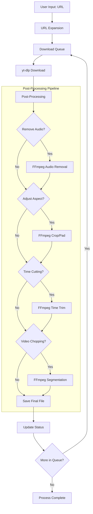

### Snippet Remixer Processing Flow

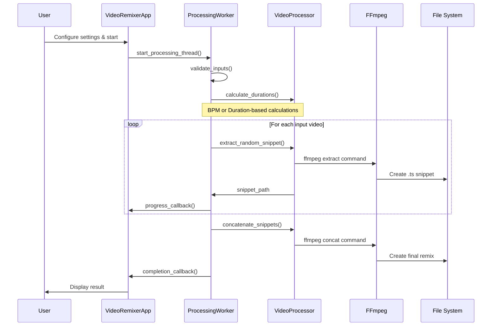

### File Organization Pipeline (Reel Tracker)

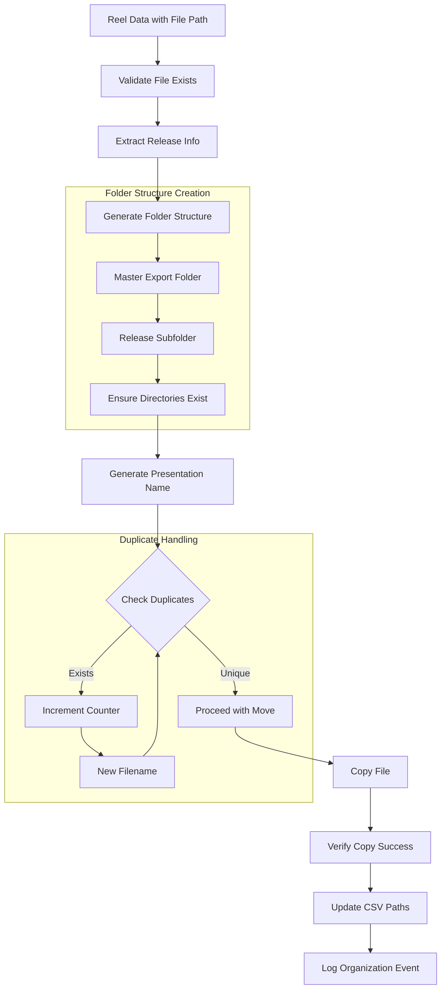

### Release Calendar Workflow

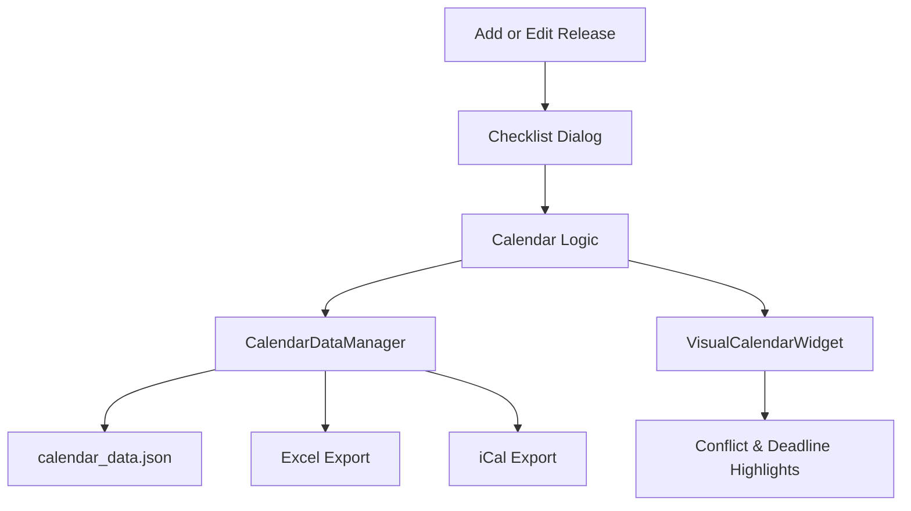

- **Data Manager Loop**: Every change flows through `CalendarDataManager`, ensuring persistence and backups.
- **Visual Feedback**: `VisualCalendarWidget` paints deliverable status and conflict warnings in real time.
- **Actionable Exports**: Users can generate spreadsheets or calendar invites without leaving the module.

### MV Maker Caption Pipeline

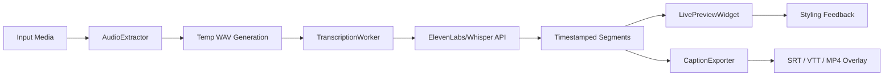

- **Parallelized Tasks**: Audio extraction, transcription, and preview updates run on dedicated worker threads.
- **Service Abstraction**: ElevenLabs or Whisper can be swapped through configuration without UI changes.
- **Comprehensive Outputs**: Caption exporter writes multiple formats while respecting styling and bitrate presets.

---

## External Dependencies and Integration

### Dependency Architecture

```mermaid
graph TB
    subgraph "Core Python Dependencies"
        PYTHON[Python 3.x Runtime]
        STD[Standard Library<br/>os, json, threading, subprocess]
    end
    
    subgraph "GUI Frameworks"
        TK[Tkinter<br/>Launcher Shell]
        QT5[PyQt5<br/>Advanced Desktop UIs]
        QT6[PyQt6<br/>Release Calendar UI]
    end
    
    subgraph "Media Processing Stack"
        YTDLP[yt-dlp<br/>Media Download Engine]
        FFMPEG[FFmpeg/FFprobe<br/>Video Processing]
        MOVIEPY[MoviePy<br/>Python Video Library]
        PIL[Pillow/PIL<br/>Image Processing]
    end
    
    subgraph "Data & Export Libraries"
        PANDAS[pandas<br/>CSV Operations]
        OPENPYXL[openpyxl / xlsxwriter<br/>Spreadsheet Export]
        ICAL[iCalendar<br/>Calendar Export]
        JSON_LIB[json<br/>Configuration]
    end
    
    subgraph "AI & Caption Services"
        ELEVEN[ElevenLabs API]
        WHISPER[Whisper Models]
        PYSRT[pysrt / webvtt-py]
    end
    
    subgraph "Application Mapping"
        LAUNCHER[launcher.py] --> TK
        MEDIA_DL[media_download_app.py] --> TK
        MEDIA_DL --> YTDLP
        MEDIA_DL --> FFMPEG
        
        REEL[reel_tracker] --> QT5
        REEL --> PANDAS
        
        SNIPPET[snippet_remixer] --> QT5
        SNIPPET --> FFMPEG
        
        SLIDESHOW[random_slideshow] --> QT5
        SLIDESHOW --> PIL
        SLIDESHOW --> MOVIEPY
        
        EDITOR[slideshow_editor.py] --> QT5
        EDITOR --> MOVIEPY
        
        CAL[release_calendar] --> QT6
        CAL --> PANDAS
        CAL --> OPENPYXL
        CAL --> ICAL
        
        MV[mv_maker] --> QT5
        MV --> FFMPEG
        MV --> ELEVEN
        MV --> WHISPER
        MV --> PYSRT
    end
```

### Critical Path Dependencies

**Essential for Core Functionality:**
1. **Python 3.x**: Runtime environment
2. **FFmpeg**: Video processing backbone
3. **yt-dlp**: Media download capability

**Framework Dependencies:**
- **Tkinter**: Bundled with Python, used for launcher and basic GUIs
- **PyQt5**: Advanced GUI components, tables, dialogs, and MV Maker UI
- **PyQt6**: Release calendar visualization and checklist flows
- **pandas**: CSV data manipulation (Reel Tracker, Release Calendar analytics)
- **MoviePy**: High-level video operations
- **Pillow**: Image processing and manipulation
- **openpyxl/xlsxwriter**: Spreadsheet export for release planning
- **iCalendar**: Calendar invite generation
- **ElevenLabs & Whisper**: AI transcription engines for MV Maker
- **pysrt/webvtt-py**: Caption serialization layers

### Dependency Integration Patterns

**Graceful Degradation:**
```python
# Example from snippet_remixer
ffmpeg_found, ffprobe_found = self.processing_worker.get_video_processor().are_tools_available()

if not ffmpeg_found or not ffprobe_found:
    missing = []
    if not ffmpeg_found: missing.append("FFmpeg")
    if not ffprobe_found: missing.append("FFprobe")
    
    messagebox.showwarning(
        "Dependency Missing",
        f"{' and '.join(missing)} not found in PATH."
    )
```

**Lazy Import Strategy:**
```python
# Example from random_slideshow/__init__.py
def get_slideshow_editor():
    """Lazy import for RandomSlideshowEditor to avoid PyQt5 dependency issues."""
    from main_app import RandomSlideshowEditor
    return RandomSlideshowEditor
```

---

## Design Patterns and Best Practices

### Architecture Patterns Implemented

#### 1. **Central Hub Pattern** (Launcher)
- **Implementation**: Process orchestration with centralized logging
- **Benefits**: Unified monitoring, simplified management
- **Use Case**: Managing multiple independent applications

#### 2. **Modular Package Pattern** (All Packages)
- **Implementation**: Clean separation with `__init__.py` exports
- **Benefits**: Reusability, testability, maintainability
- **Use Case**: Complex applications with multiple concerns

#### 3. **Worker Thread Pattern** (Processing-Heavy Apps)
- **Implementation**: Background processing with GUI progress updates
- **Benefits**: Responsive UI, progress tracking
- **Use Case**: Video processing, file operations

#### 4. **Configuration Strategy Pattern** (Multiple Config Types)
- **Implementation**: Per-application configuration with different complexity levels
- **Benefits**: Tailored configuration, evolution path
- **Use Case**: Applications with varying configuration needs

#### 5. **Lazy Import Pattern** (Package Modules)
- **Implementation**: Function-based imports to avoid dependency issues
- **Benefits**: Faster startup, optional dependencies
- **Use Case**: Packages with heavy external dependencies

### Error Handling Strategies

**Multi-Layer Error Handling:**
```mermaid
graph TD
    APP[Application Layer] --> |Try-Catch| COMP[Component Layer]
    COMP --> |Validation| DATA[Data Layer]
    DATA --> |Fallbacks| EXT[External Dependencies]
    
    APP --> USER[User Feedback]
    COMP --> LOG[Logging System]
    DATA --> CONFIG[Configuration Defaults]
    EXT --> GRACEFUL[Graceful Degradation]
```

**Error Handling Patterns:**
- **Reel Tracker**: `safe_print()` function for Unicode handling
- **Launcher**: Process isolation prevents cascading failures
- **Snippet Remixer**: FFmpeg availability checking
- **All Apps**: Configuration file fallbacks and defaults

---

## Security and Error Handling

### Input Validation and Security

**File Path Sanitization:**
```python
# Example from various modules
def validate_directory_path(path):
    """Validate directory path for security and existence."""
    if not isinstance(path, str):
        return False
    if not os.path.isdir(path):
        return False
    # Additional sanitization logic
    return True
```

**Configuration Security:**
- **Local Storage Only**: No network transmission of configuration data
- **Path Validation**: Directory traversal prevention
- **Type Validation**: Strict type checking for configuration values
- **Default Fallbacks**: Secure defaults when configuration is corrupted

### Process Security Architecture

**Process Isolation:**
- Each application runs as independent process
- Failure isolation prevents system-wide crashes
- Resource limits through process group management
- Secure subprocess spawning with controlled environments

**Resource Management:**
- **Memory**: Automatic cleanup of large objects (MoviePy clips)
- **File Handles**: Proper cleanup of temporary files
- **Process Handles**: Graceful termination sequences
- **Thread Management**: Daemon threads for background operations

---

## Performance Analysis and Optimization

### Performance Characteristics by Component

```mermaid
graph LR
    subgraph "I/O Bound Operations"
        DOWNLOAD[Media Download<br/>Network Limited]
        FILE_ORG[File Organization<br/>Disk I/O Limited]
        CSV[CSV Operations<br/>Pandas Optimized]
    end
    
    subgraph "CPU Bound Operations"
        VIDEO[Video Processing<br/>FFmpeg Dependent]
        SLIDESHOW[Slideshow Generation<br/>MoviePy + PIL]
        RESIZE[Image Resize<br/>PIL Optimized]
    end
    
    subgraph "Memory Bound Operations"
        LARGE_VIDEO[Large Video Clips<br/>MoviePy Memory]
        BATCH_IMG[Batch Image Loading<br/>PIL Memory]
        CONFIG[Configuration<br/>JSON Memory]
    end
```

### Optimization Strategies Implemented

**Threading Architecture:**
- **Background Processing**: Worker threads for CPU-intensive tasks
- **Non-blocking UI**: Responsive interfaces during processing
- **Progress Reporting**: Real-time status updates

**Memory Management:**
- **Lazy Loading**: Import dependencies only when needed
- **Object Cleanup**: Explicit cleanup of large media objects
- **Stream Processing**: Line-by-line processing for large files

**File System Optimization:**
- **Intermediate Formats**: `.ts` files for reliable video concatenation
- **Batch Operations**: Efficient multi-file processing
- **Path Caching**: Configuration path persistence

### Performance Metrics and Bottlenecks

| Operation | Primary Bottleneck | Optimization Strategy |
|-----------|-------------------|---------------------|
| **Media Download** | Network bandwidth | Parallel downloads, yt-dlp optimization |
| **Video Processing** | CPU + FFmpeg efficiency | Native FFmpeg, optimized parameters |
| **Slideshow Generation** | Memory + MoviePy | Efficient clip management, PIL optimization |
| **File Organization** | Disk I/O | Batch operations, smart duplicate checking |
| **CSV Operations** | pandas efficiency | Efficient DataFrame operations |

---

## Development Guidelines and Standards

The suite includes comprehensive development guidelines documented in `src/MODULARIZATION_GUIDELINES.md`, establishing patterns for future development.

### Code Quality Standards

**Module Structure Pattern:**
```
package_name/
├── __init__.py              # Package exports and lazy imports
├── main_app.py              # Main application/GUI class
├── config_manager.py        # Configuration handling
├── core_logic.py            # Core business logic
├── worker_threads.py        # Background processing
├── dialogs.py               # UI dialogs and forms
├── utils.py                 # Utility functions
└── README.md                # Module documentation
```

**Configuration Management Pattern:**
```python
class ConfigManager:
    def __init__(self, config_file="config/app_config.json"):
        self.config_file = config_file
        self.config_dir = os.path.dirname(config_file)
        self.config = self.load_config()
    
    def load_config(self):
        # Robust loading with fallbacks
        # Error handling and validation
        # Default configuration generation
```

**Error Handling Pattern:**
```python
from .utils import safe_print

def robust_function(param):
    try:
        result = process_param(param)
        return result
    except SpecificException as e:
        safe_print(f"Specific error in robust_function: {e}")
        return None
    except Exception as e:
        safe_print(f"Unexpected error in robust_function: {e}")
        return None
```

### Modularization Success Criteria

**Technical Metrics:**
1. **Maintainability**: Each module has single, clear purpose
2. **Testability**: Components can be tested in isolation
3. **Reusability**: Modules can be imported independently
4. **Scalability**: New features added without major refactoring
5. **Performance**: No significant performance degradation
6. **Documentation**: Clear interfaces and usage examples

---

## Future Architecture Roadmap

### Immediate Enhancements (Next 3-6 months)

**1. API Layer Development**
- RESTful API for external integration
- Webhook support for job notifications
- Authentication and rate limiting
- OpenAPI documentation

**2. Enhanced Testing Framework**
- Unit testing with pytest
- Integration testing for workflows
- Performance regression testing
- Automated GUI testing

**3. Cloud Integration Preparation**
- Docker containerization
- Configuration externalization
- Stateless processing design
- Scalable storage abstractions

### Medium-term Evolution (6-12 months)

**1. Plugin Architecture**
- Extension point framework
- Custom processing plugins
- Third-party integration plugins
- Plugin marketplace concept

**2. Advanced Analytics**
- Processing performance metrics
- User behavior analytics
- Resource utilization dashboards
- Predictive optimization

**3. Unified Release Commerce Platform**
- Central web app covering merch, sample packs, and persona landing pages
- Automated link-in-bio generator aligned with release calendar milestones
- Shopify/Printful integration, payment gateway, and preset-driven page builder
- Streaming embed + analytics instrumentation for every drop

**4. Collaborative Features**
- Multi-user job queues
- Shared preset libraries
- Team project management
- Version control integration

### Long-term Vision (12+ months)

**1. AI Integration**
- Content recommendation engine
- Automated quality assessment
- Smart parameter optimization
- Intelligent error recovery

**2. Cross-Platform Distribution**
- Web-based interface
- Mobile companion apps
- Cloud processing options
- Real-time collaboration

**3. Enterprise Features**
- Advanced user management
- Audit and compliance features
- Enterprise security integration
- SLA monitoring and reporting

### Technical Debt and Modernization

**Priority Technical Improvements:**
1. **Complete Test Coverage**: Achieve 90%+ test coverage across all modules
2. **Type Annotations**: Add comprehensive type hints for better IDE support
3. **Async Processing**: Migrate to asyncio for better I/O performance
4. **Database Integration**: Replace JSON configs with proper database for enterprise features
5. **Security Hardening**: Implement comprehensive security audit and improvements

**Architecture Modernization Path:**
1. **Microservices Transition**: Gradually decompose into independently deployable services
2. **Event-Driven Architecture**: Implement message queues for loose coupling
3. **Configuration as Code**: Infrastructure automation and deployment pipelines
4. **Observability**: Comprehensive monitoring, tracing, and alerting systems

---

*Document Version: 3.1*  
*Generated by: Comprehensive Multi-Perspective Analysis*  
*Date: 2025-01-27*  
*Architecture Review: Complete System Analysis with Product, Developer, and Architect Perspectives*
*Recent Updates: Batch Processing, Enhanced Continuous Mode, Standalone Tools Analysis, Real-time Configuration Updates, Release Calendar & MV Maker Coverage*
